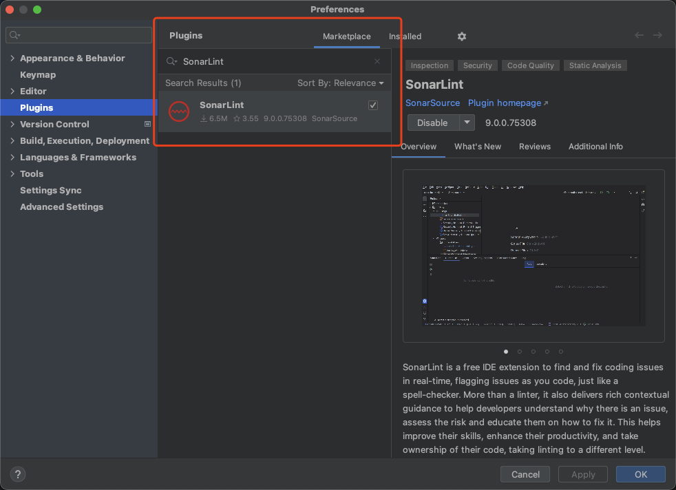
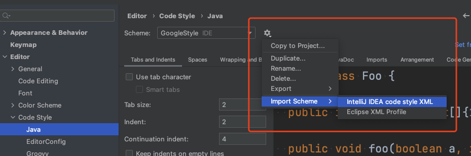
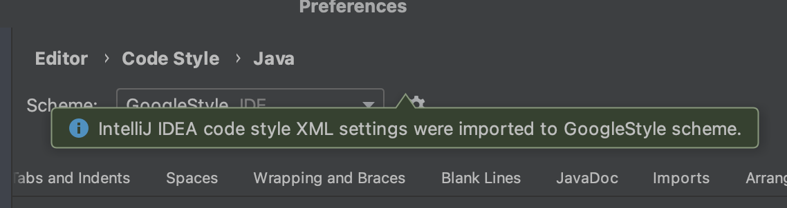
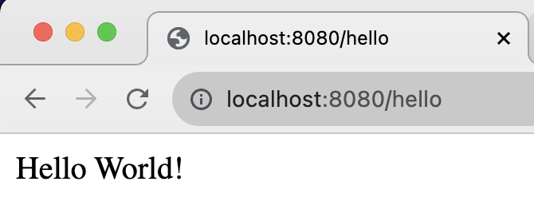
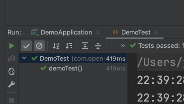
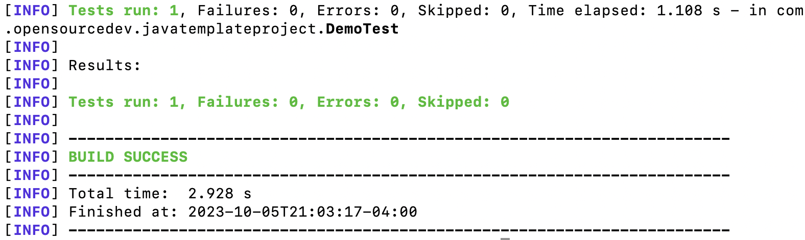

# open-source-java-template

## Measures of Success:
* Programming Language: **Java**
* Runtime Environment: **JDK 17**
* Testing Framework: **JUnit**
* Continuous Integration: **GitHub Actions**
* Static Analysis: **SonarLint**
* Code Formatting: **Google Style Guide**
* Package Manager: **Maven**

## How To Use This Repo

### Download and Install
1. [IntelliJ IDEA Community Edition](https://www.jetbrains.com/idea/download)
2. [JDK 17](https://www.oracle.com/java/technologies/javase/jdk17-archive-downloads.html) (use `java -version` to verify installation in terminal)
3. [Maven](https://maven.apache.org/download.cgi) (use `mvn -v` to verify installation in terminal)

### Clone and Open Project
4. clone the project using `git clone https://github.com/M2JT/open-source-java-template`
5. In IntelliJ, **File** -> **Open** `java-template-project`

### Set up Static Analysis Tool
6. In IntelliJ, **Preferences** -> **Plugins**, find `SonarLint` from the marketplace and install it

### Set up Code Formatting
7. In IntelliJ, **Preferences** -> **Editor** -> **Code Style** -> **Java**, click the settings icon next to Scheme and import the `java-template-project/intellij-java-google-style.xml` file

### Run the Hello World Program
8. In IntelliJ, go to **src** -> **main** -> **java** -> **com.opensourcedev.javatemplateproject**, and run `DemoApplication`
9. Check out `http://localhost:8080/hello` in browser, you should be seeing `Hello World!` on the screen

### Run the Test
10. In IntelliJ, go to **src** -> **test** -> **java** -> **com.opensourcedev.javatemplateproject**, and run `DemoTest`

11. Alternatively, you can run `mvn test` on the root directory in terminal

## .gitignore
Most are default options provided by GitHub that cover common patterns for ignoring files and directories in a Java project. Added `.idea` and `.DS_Store` to ignore IntelliJ IDEA-specific configuration files/directories and macOS-specific file.

## About the License
The GNU General Public License (GPL) version 3.0 is a strong copyleft license that comes with certain requirements and restrictions. This license ensures that anyone who uses or modifies our code must also make their contributions available under the same terms, fostering a collaborative and transparent development environment. Therefore, choosing the GPL-3.0 license for our project is suitable as we want to promote open-source principles and ensure that our project and any derivative works remain open source.