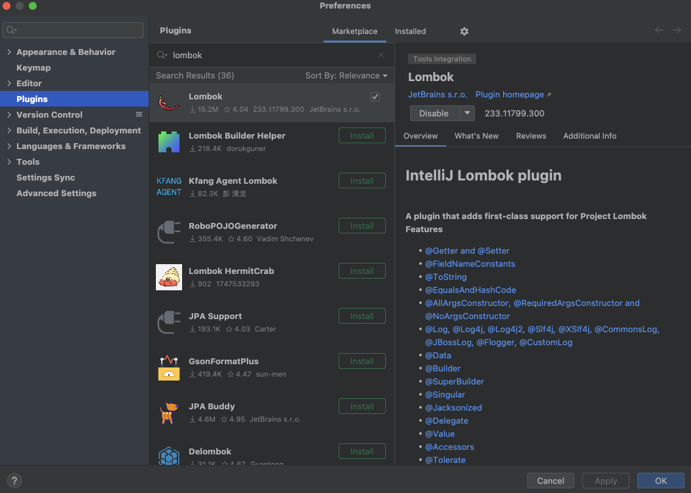

# charge-finder

## Background & Objective
We all know how annoying it can be when our devices run out of battery, especially when we are out and about. Picture this: you forgot to charge your phone/laptop last night, but you’ve got a full day of outdoor work ahead. That’s why ChargeFinder is here. It is a handy app that saves you from the dreaded “low battery anxiety.” With ChargeFinder, you can quickly locate nearby spots where you can grab a shared power bank for a quick charge.

## Features
### Home Page


- Explore the map and find the charging stations near you! You can click on any stations to check its detail
- `Get Direction` will show you the route to a selected charging station based on the travel mode selected (walking, driving, bicycling, transit)
- Click `Rent` to rent a power bank, notice that this button won't appear unless you are logged-in
- The `You are here!` marker shows where you currently are on the map. If you don't give browser permission to access your location, a default location will be used instead
- Click the center icon on the top of the screen to have map recentered back to you

### Rental History Page


- View your current or past rental history. Current rental would have a `Rented` status and past rental would show `Returned`
- `Duration` field would show your current rental duration and is updated in real-time
- Click `Return` to return a power bank, you will be charged (simulation charge) based on the closest hours you have rented
- Be aware that you can't view your rental history unless you are logged-in

### Login Page


- Login using your newly created account credentials
- JWT authentication mechanism used
- Error message would show up if credentials don't match with what we stored in the database

### Register Page


- Create a new account on our site
- JWT authentication mechanism used
- Error message would show up if trying to register account with duplicate username or email
- Secure password-hashing using Bcrypt

### Account Page


- View your account information
- Click `Logout` to logout

## Team Members
- Jason Lai: full-stack developer
- Felina Korte: full-stack developer
- Sriram Kora: full-stack developer
- Thejus Hari Krishna Rao: backend developer
- Zayyan Farooqi: backend developer

## How To Run This Project
### Download and Install
1. [IntelliJ IDEA Community Edition](https://www.jetbrains.com/idea/download) (for back-end usage)

2. [JDK 17](https://www.oracle.com/java/technologies/javase/jdk17-archive-downloads.html) (use `java -version` to verify installation in terminal)

3. [Maven](https://maven.apache.org/download.cgi) (use `mvn -v` to verify installation in terminal)

4. [Visual Studio Code](https://code.visualstudio.com/download) (for front-end usage)

5. In IntelliJ, **Preferences** -> **Plugins**, install `Lombok` from the marketplace



### In the Back-end Directory

#### Set Up and Run the Back-end
1. In IntelliJ, click the reload icon to ensure all dependencies are installed, then click `clean` and `compile`, you should see `[INFO] BUILD SUCCESS` shown in the Run tab for each of these operations.


2. create a `env.properties` file and save it in the root (`/env.properties`) directory (where the github project is present). To ensure this file is configured with the correct environmental variables, please contact our developers for more information, as those data are sensitive and not allowed to be publicly shared on GitHub.

The `env.properties` file should look something like this

```
DB_URL=jdbc:mysql:aws://charge-finder.cbqttujwav7z.us-east-2.rds.amazonaws.com:3306/charge_finder
DB_USERNAME=username
DB_PASSWORD=password
``` 

3. Go to **src** -> **main** -> **java** -> **com.opensourcedev.backend**, and run `MainApplication`, this will boot up the back-end.


### In the Front-end Directory

#### Set Up and Run the Front-end
1. In VS Code, Run `npm install` to install all dependencies listed in `package.json`.

2. Please follow the  instructions in .env file in the front-end folder (`/front-end/.env`) to ensure the project is properly configured with the correct environmental variables. In case of issues, please contact our developers for more information, these data are sensitive and not allowed to be publicly shared on GitHub.

The `.env` file should look something like this

```
#add your google maps api key below for the map functionalities of the project to work
REACT_APP_API_KEY = 
REACT_APP_SERVER_URL = http://localhost:8080
``` 

3. Run `npm start` to start the front-end.

4. Open [http://localhost:3000](http://localhost:3000) to view our app in your browser.

### Run the Tests

1. In IntelliJ, go to **src** -> **test** -> **java** -> **com.opensourcedev.backend**, and run `MainTest.java`


2. Alternatively, you can run `mvn test` in back-end's root directory using terminal.


3. You can also run postman tests for integration testing by importing and running the collections inside 
[LoginResgisterTests](postma%20tests/Login-register.postman_collection.json)